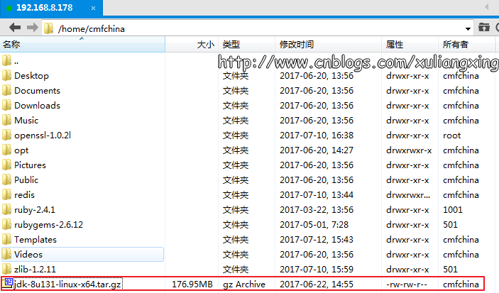
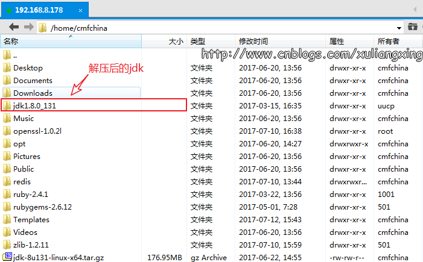
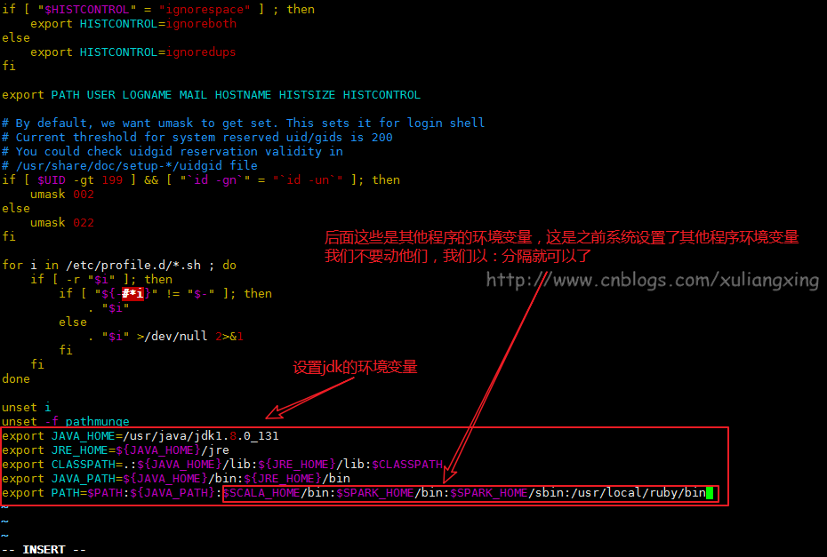

Linux下jdk安装


------

本文主要介绍的是如何是Linux环境下安装JDK的，因为Linux环境下，很多时候也离不开Java的，下面笔者就和大家一起分享如何jdk1.8的过程吧。

# 一、安装环境

操作系统：Red Hat Enterprise Linux 6 64 位(版本号6.6)

JDK版本：1.8

工具：Xshell5、Xftp5

说明：本文是通过Xshell5工具远程连接Linux操作，如果是直接在Linux可视化界面操作那就更方便了，原理一样。

# 二、安装步骤

**第一步：下载安装包**

下载Linux环境下的jdk1.8，请去（[官网](http://www.oracle.com/technetwork/java/javase/downloads/jdk8-downloads-2133151.html)）中下载jdk的安装文件；

由于我的Linux是64位的，因此我下载[jdk-8u131-linux-x64.tar.gz](http://download.oracle.com/otn-pub/java/jdk/8u131-b11/d54c1d3a095b4ff2b6607d096fa80163/jdk-8u131-linux-x64.tar.gz)。

如下图所示：


如果Linux本身连接到互联网，我们可以直接通过wget命令直接把JDK安装包下载下来，如图所示：


要是没有外网的环境，还是安装上面的方法下载安装包，然后上传到服务器当中


**linux-jdk8_191百度云下载地址:**

​    **链接：https://pan.baidu.com/s/1OxMB6JfxC8ZK_8kaVFJ1fw** 

​     **提取码：j972** 


**第二步、解压安装包**

将我们下载好的JDK安装包上传到服务器，进行解压



解压命令进行解压

```
1 $ cd  /home/cmfchina
2 $ tar  -zxvf  jdk-8u131-linux-x64.tar.gz
```


解压完成之后，可以在当前目录下看到一个名字为【jdk1.8.0_131】的目录，里面存放的是相关文件



我们要将解压后的【jdk1.8.0_131】里面的所有数据移动到我们需要安装的文件夹当中，我们打算将jdk安装在usr/java当中，我们在usr目录下新建一个java文件夹

```
mkdir /usr/java
```


将【jdk1.8.0_131】里的数据拷贝至java目录下

```
mv /home/cmfchina/jdk1.8.0_131 /usr/java
```


**第三步、修改环境变量**

至此，我们最后需要修改环境变量，通过命令

```
vim /etc/profile
```


用vim编辑器来编辑profile文件，在文件末尾添加一下内容（按“i”进入编辑）：

 

```
export JAVA_HOME=/usr/java/jdk1.8.0_131
export JRE_HOME=${JAVA_HOME}/jre
export CLASSPATH=.:${JAVA_HOME}/lib:${JRE_HOME}/lib:$CLASSPATH
export JAVA_PATH=${JAVA_HOME}/bin:${JRE_HOME}/bin
export PATH=$PATH:${JAVA_PATH}
```

如图所示：



然后，保存并退出(按：wq!)

保存完之后，我们还需要让这个环境变量配置信息里面生效，要不然只能重启电脑生效了。

通过命令source /etc/profile让profile文件立即生效，如图所示


**第四步、测试是否安装成功**

①、使用javac命令，不会出现command not found错误

②、使用java -version，出现版本为java version "1.8.0_131"

③、echo $PATH，看看自己刚刚设置的的环境变量配置是否都正确

如图所示：


至此，安装结束。


------


**Linux下切换使用两个版本的JDK**

我这里原来已经配置好过一个1.7版本的jdk。
输出命令: 
`java -version`

 

```
[root@hu-hadoop1 sbin]# java -version
java version "1.7.0_79"
Java(TM) SE Runtime Environment (build 1.7.0_79-b15)
Java HotSpot(TM) 64-Bit Server VM (build 24.79-b02, mixed mode)
```

java JDK1.8_191安装过后，会发现jdk仍然是1.7的版本。用如下命令查看已配置好的jdk:

 

```
alternatives --config java
```


会发现jdk1.8_191没有配置，ctrl + c 退出，使用如下命令,将刚安装的jdk1.8_191加入配置：

 

```
alternatives --install /usr/bin/java java /usr/java/jdk1.8.0_191/bin/java 2
```

如果添加错误可以使用以下命令删除:

 

```
alternatives --remove java usr/java/jdk1.8.0_191/bin
```

然后使用以下命令切换两个JDK的使用，选择刚配置的jdk1.8_191，输入配置时的编号2即可：

 

```
alternatives --config java
```

然后再输入命令，即可查看到jdk已经切换了：

 

```
java -version
```

**注意：**

如果切換完成后发现版本不能改变时，你可以将 

vi /etc/profile 

中的JAVA_HOME注释调，然后重新加载一下配置文件， 

source /etc/profile 

发现可以了，java版本切换成功了。 

然后你再把配置文件改回来，重新加载，然后就可以了